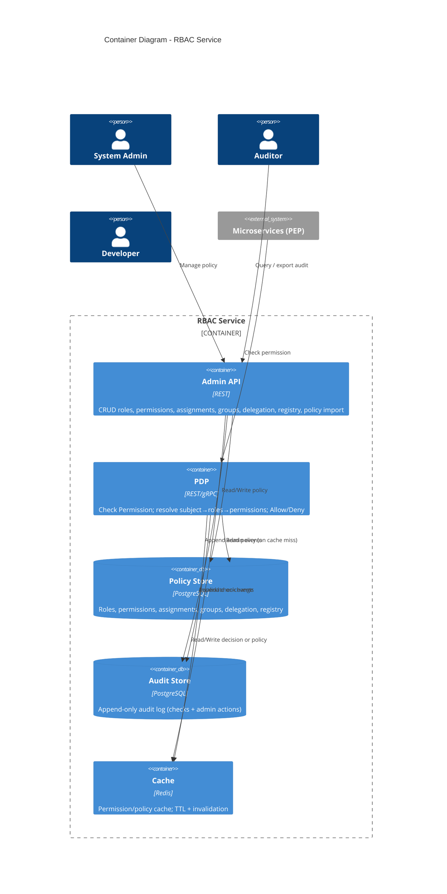

# Container Diagram — RBAC for Microservices (C4 Level 2)

**Version:** 1.0  
**Date:** 2025-03-15  
**Author:** Architect  
**Source:** HANDOFF-TO-ARCHITECT.md, FRS-RBAC.md, process-flows-RBAC.md

---

## 1. Purpose

This document describes the **Containers** (C4 Level 2) inside the RBAC system: the main deployable components and how they interact. It separates **control plane** (admin API, policy management) from **data plane** (PDP), and shows audit and cache.

---

## 2. Container Overview

| Container | Type | Responsibility |
|-----------|------|----------------|
| **Admin API** | Application | Control plane: CRUD roles, permissions, assignments, groups, delegation, resource registry, policy import. Validates tenant; writes audit for admin actions; triggers cache invalidation. |
| **PDP (Policy Decision Point)** | Application | Data plane: Check Permission (and batch check). Resolves subject → roles → permissions; evaluates (resource, action); reads from cache/Policy Store; writes audit for every check. Stateless, horizontally scalable. |
| **Policy Store** | Database | Persistent store for roles, permissions, assignments, groups, delegation rules, resource registry, role hierarchy. Source of truth for policy. |
| **Audit Store** | Database | Append-only store for (1) permission check events, (2) admin action events. Used for query and export; retention configurable (e.g. 1 year). |
| **Cache** | Cache | Caches permission decisions and/or policy data for PDP to meet p99 &lt; 50ms. Invalidated on policy/assignment changes. |

---

## 3. C4 Level 2 — Container Diagram (Mermaid)

---

## 4. Data Flow Summary

### 4.1 Control plane (Admin)

1. **Admin API** receives CRUD/assign/delegate/registry/import requests.
2. **Admin API** reads/writes **Policy Store** (roles, permissions, assignments, groups, delegation, registry).
3. **Admin API** appends to **Audit Store** for each admin action.
4. **Admin API** triggers **Cache** invalidation (by subject, role, or tenant as per ADR-003).

### 4.2 Data plane (Check Permission)

1. **PEP** (microservice or SDK) calls **PDP** with (subject, resource, action, tenant, optional scope).
2. **PDP** checks **Cache** (e.g. key: tenant+subject+resource+action+scope). On hit: return cached decision, then write audit and return.
3. On cache miss: **PDP** reads from **Policy Store** (or from cache if policy data is cached), resolves subject → groups → roles (with inheritance) → permissions, evaluates (resource, action), optionally filters by scope.
4. **PDP** writes one audit record to **Audit Store** per check (Allow/Deny).
5. **PDP** writes result to **Cache** with TTL, returns `{ allowed }` to PEP.

### 4.3 Audit query / export

1. **Auditor** calls **Admin API** (audit query/export endpoints).
2. **Admin API** authorizes caller (e.g. Auditor role), then reads **Audit Store** with filters (date, user, resource, action, tenant) and pagination; returns JSON or CSV.

---

## 5. Deployment Notes

- **Admin API** and **PDP** are separate deployables (or same process with separate routes) so PDP can scale independently (FR-013).
- **Policy Store** and **Audit Store** may be separate PostgreSQL databases or schemas for isolation and retention (ADR-002, ADR-004).
- **Cache** is shared (e.g. Redis cluster) so all PDP instances see the same cache and invalidation is global.
- All components are tenant-aware; every request carries tenant context (header or token).

---

## 6. NFR Alignment

| NFR | How containers support it |
|-----|---------------------------|
| p99 &lt; 50ms | PDP uses cache for hot path; cache hit avoids Policy Store read; audit write async or non-blocking where possible (ADR-004). |
| 99.9% availability | Stateless Admin API and PDP behind load balancer; Policy Store and Audit Store with replication; Redis HA. |
| Audit compliance | 100% of checks and admin actions written to Audit Store; append-only; retention and export as per ADR-004. |

---

## 7. Document History

| Version | Date | Author | Changes |
|---------|------|--------|---------|
| 1.0 | 2025-03-15 | Architect | Initial container diagram from BA handoff |
