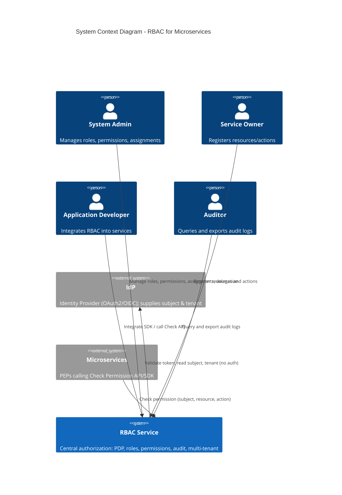

# System Context Diagram — RBAC for Microservices (C4 Level 1)

**Version:** 1.0  
**Date:** 2025-03-15  
**Author:** Architect  
**Source:** HANDOFF-TO-ARCHITECT.md, FRS-RBAC.md

---

## 1. Purpose

This document describes the **System Context** (C4 Level 1): the RBAC system as a single box and its interactions with users and external systems. It defines system boundaries and integration points.

---

## 2. System Description

**RBAC Service** is a central authorization service for microservices. It provides:

- Role and permission model (CRUD roles, assign permissions, assign roles to users/groups)
- Policy Decision Point (PDP): Check Permission API returning Allow/Deny
- Audit logging (every check + every admin action)
- Multi-tenancy with tenant isolation
- SDKs (Node, Go, Java) and optional resource registry / policy-as-code

Authentication is **out of scope**: the system integrates with an existing IdP; identity (subject, tenant) is derived from tokens.

---

## 3. Actors and External Systems

| Actor / System | Type | Description |
|----------------|------|-------------|
| **System Admin** | Person | Manages RBAC: CRUD roles, assign permissions, assign roles to users/groups, delegation, view audit. |
| **Service Owner** | Person | Registers resources and actions for their service in the Resource Registry. |
| **Application Developer** | Person | Integrates RBAC into microservices via SDK or direct API calls. |
| **Auditor** | Person | Queries and exports audit logs for compliance and reporting. |
| **IdP (Identity Provider)** | External System | Supplies user identity (OAuth2/OIDC). RBAC consumes subject id and optionally tenant from token; does not authenticate. |
| **Microservices (PEP)** | External System | Applications that enforce authorization; call RBAC Check Permission API (or SDK) to get Allow/Deny. |

---

## 4. C4 Level 1 — System Context Diagram (Mermaid)



---

## 5. Text Representation (Alternative)

```
                    +------------------+
                    |   System Admin   |
                    +--------+---------+
                             | manage roles, permissions, assignments
                             v
+------------------+   +------------------+   +------------------+
|  Service Owner   |   |                  |   |     Auditor      |
+--------+---------+   |   RBAC Service   |   +--------+---------+
         |             |                  |            |
         | register    |  - PDP (Allow/   |            | query / export
         | resources   |    Deny)         |            | audit logs
         v             |  - Roles, perms  |            v
              +--------+  - Audit         +-------------------+
              |        |  - Multi-tenant |
              |        +--------+--------+
              |                 ^
              |                 | check permission
              |        +--------+--------+
              |        |  Microservices  |
              |        |  (PEP)          |
              |        +--------+--------+
              |                 |
              |                 | token validation (subject, tenant)
              |        +--------+--------+
              +------->|       IdP       |
                       +-----------------+
```

---

## 6. Key Interfaces (Summary)

| From | To | Interaction |
|------|-----|-------------|
| System Admin | RBAC Service | REST API: CRUD roles, assign permissions, assign roles to user/group, delegation, view audit. |
| Service Owner | RBAC Service | REST API: Register resources and actions (Resource Registry). |
| Application Developer / Microservices | RBAC Service | Check Permission API (REST or gRPC): `(subject, resource, action)` → `{ allowed }`; SDK wraps this. |
| Auditor | RBAC Service | REST API: Query audit, export audit (CSV/JSON). |
| RBAC Service | IdP | Token validation (introspection or JWT verify); read `sub`, optional `tenant` claim. |

---

## 7. NFR Alignment

- **Latency (p99 < 50ms):** Check Permission path is the critical path; PDP and cache design must support this (see Container Diagram and ADRs).
- **Availability (99.9%):** RBAC service is a single logical system; internal components (API, PDP, store, cache) are designed for redundancy and horizontal scaling.
- **Audit compliance:** Every check and every admin action are logged; audit storage and retention are specified in ADR-004.

---

## 8. Document History

| Version | Date | Author | Changes |
|---------|------|--------|---------|
| 1.0 | 2025-03-15 | Architect | Initial system context from BA handoff |
