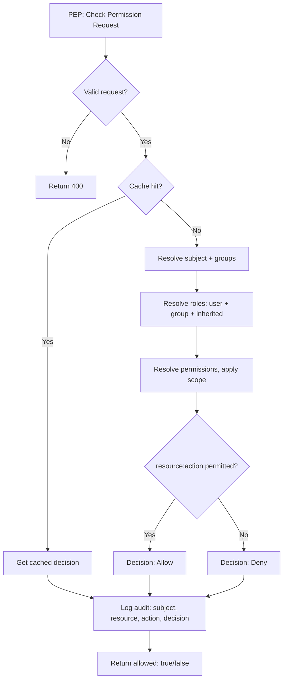
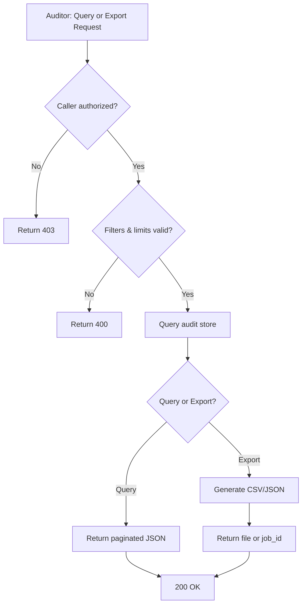

# Process Flows — RBAC for Microservices

**Version:** 1.0  
**Date:** 2025-03-15  
**Author:** Business BA  
**Related:** FRS-RBAC.md, PRD-RBAC-Microservices.md

---

This document describes the main business process flows for the RBAC system: **Assign Role to User/Group**, **Check Permission (Allow/Deny)**, and **Audit Query / Export**.

---

## 1. Assign Role to User / Group

### 1.1 Purpose

Allow a System Admin (or delegated admin) to assign one or more roles to a user or to a group, so that the user(s) gain the permissions of those roles within the tenant (and optional scope).

### 1.2 Trigger

- System Admin (or delegated user with delegation rule) requests to assign role(s) to a user or to a group.
- Input: User ID or Group ID, Role ID(s), optional Scope (e.g. org_id, project_id), Tenant ID.

### 1.3 Process Flow — Assign Role to User

| Step | Actor | Action | System Response |
|------|--------|--------|------------------|
| 1 | Admin | Call Assign Role to User API with (user_id, role_id[], tenant_id, optional scope) | — |
| 2 | System | Validate tenant context (X-Tenant-ID or equivalent) | Return 401/403 if missing or invalid |
| 3 | System | Authorize caller (caller has right to assign roles in this tenant/scope; check delegation if not full admin) | Return 403 if not authorized |
| 4 | System | Validate user exists and belongs to tenant | Return 404 if user not found |
| 5 | System | Validate each role exists and belongs to tenant | Return 400 if any role invalid |
| 6 | System | If scope is used, validate scope (e.g. org/project exists) | Return 400 if scope invalid |
| 7 | System | Create user-role assignment(s); skip or update if already assigned per business rule | — |
| 8 | System | Write audit log (actor, action: assign_role_to_user, user_id, role_ids, scope, tenant, timestamp) | — |
| 9 | System | Invalidate cache for this user (and any cached permission set) | — |
| 10 | System | Return success (201/200) and assignment details | — |

### 1.4 Process Flow — Assign Role to Group

| Step | Actor | Action | System Response |
|------|--------|--------|------------------|
| 1 | Admin | Call Assign Role to Group API with (group_id, role_id[], tenant_id, optional scope) | — |
| 2 | System | Validate tenant context | Return 401/403 if missing or invalid |
| 3 | System | Authorize caller | Return 403 if not authorized |
| 4 | System | Validate group exists and belongs to tenant | Return 404 if group not found |
| 5 | System | Validate each role exists and belongs to tenant | Return 400 if any role invalid |
| 6 | System | If scope is used, validate scope | Return 400 if scope invalid |
| 7 | System | Create group-role assignment(s) | — |
| 8 | System | Write audit log (actor, action: assign_role_to_group, group_id, role_ids, scope, tenant, timestamp) | — |
| 9 | System | Invalidate cache for the group and for all users in the group (effective permissions changed) | — |
| 10 | System | Return success (201/200) | — |

### 1.5 Diagram — Assign Role to User / Group (Mermaid)

```mermaid
flowchart TD
    A[Admin: Request Assign Role] --> B{Valid tenant?}
    B -->|No| C[Return 401/403]
    B -->|Yes| D{Caller authorized?}
    D -->|No| E[Return 403]
    D -->|Yes| F{User/Group exists in tenant?}
    F -->|No| G[Return 404]
    F -->|Yes| H{Role(s) valid in tenant?}
    H -->|No| I[Return 400]
    H -->|Yes| J[Create assignment(s)]
    J --> K[Write audit log]
    K --> L[Invalidate cache]
    L --> M[Return 201/200]
```

### 1.6 Output

- **Success:** HTTP 201/200; assignment(s) created; audit record written; cache invalidated.
- **Failure:** 400 (validation), 403 (forbidden), 404 (user/group/role not found).

---

## 2. Check Permission (Allow / Deny Flow)

### 2.1 Purpose

Allow a microservice (PEP) to ask the RBAC service (PDP) whether a subject (user or service account) is allowed to perform an action on a resource. The PDP returns Allow or Deny; every check is logged for audit.

### 2.2 Trigger

- Application (PEP) needs to authorize an operation: e.g. "Can user U do action A on resource R?"
- Input: Subject ID (user_id or service account), Resource, Action, Tenant ID, optional Scope (e.g. org_id).

### 2.3 Process Flow — Check Permission

| Step | Actor | Action | System Response |
|------|--------|--------|------------------|
| 1 | PEP / Client | Call Check Permission API (e.g. POST /check) with body: subject, resource, action; headers: tenant (e.g. X-Tenant-ID), optional scope | — |
| 2 | System | Validate request (subject, resource, action, tenant present) | Return 400 if missing |
| 3 | System | Optional: Check cache (key: tenant + subject + resource + action + scope). If hit and not expired, go to step 7 with cached decision | — |
| 4 | System | Resolve subject: load user and all groups the user belongs to (tenant-scoped) | — |
| 5 | System | Resolve roles: collect all roles assigned to user directly + all roles assigned to user's groups; expand with role inheritance (add parent role permissions) | — |
| 6 | System | Resolve permissions: aggregate all permissions from those roles (resource:action, including wildcards). If scope is used, filter assignments by scope. Evaluate whether (resource, action) is in the set (exact or wildcard match) | Decision: Allow or Deny |
| 7 | System | Write audit log (subject, resource, action, decision: Allow/Deny, tenant, scope, timestamp, optional request_id) | — |
| 8 | System | If cache miss and caching enabled: store (tenant, subject, resource, action, scope) → decision with TTL | — |
| 9 | System | Return { allowed: true } or { allowed: false } | — |

### 2.4 Diagram — Check Permission (Mermaid)



### 2.5 Deny-by-Default

- If subject has no roles, or no role grants the (resource, action), the result is **Deny**.
- Default policy for a new tenant is deny-all until roles are assigned (FR-022).

### 2.6 Output

- **Success:** `{ "allowed": true }` or `{ "allowed": false }`; HTTP 200.
- **Audit:** Every check produces one audit log entry (Allow or Deny).
- **Constraints:** p99 latency < 50ms; 100% of checks audited.

---

## 3. Audit Query / Export

### 3.1 Purpose

Allow an Auditor (or authorized admin) to query audit logs (permission checks and/or admin actions) and to export them (e.g. CSV/JSON) for a time range and optional filters, with pagination.

### 3.2 Trigger

- Auditor requests to query or export audit log.
- Input: Date range (from, to), optional filters (user_id, resource, action, tenant, event_type: check vs admin), format (CSV/JSON), pagination (limit, offset or cursor).

### 3.3 Process Flow — Audit Query

| Step | Actor | Action | System Response |
|------|--------|--------|------------------|
| 1 | Auditor | Call Audit Query API with filters (date_from, date_to, user_id, resource, action, tenant, event_type) and pagination | — |
| 2 | System | Validate caller is authorized (e.g. has Auditor role or equivalent) | Return 403 if not authorized |
| 3 | System | Validate date range and limits (e.g. max range or max page size per policy) | Return 400 if invalid |
| 4 | System | Query audit store with filters and pagination | — |
| 5 | System | Return page of audit records (e.g. list of events with subject, resource, action, decision, timestamp, tenant, etc.) | 200 + JSON body |

### 3.4 Process Flow — Audit Export

| Step | Actor | Action | System Response |
|------|--------|--------|------------------|
| 1 | Auditor | Call Audit Export API with filters (date_from, date_to, user_id, resource, action, tenant, event_type), format (CSV/JSON), optional pagination | — |
| 2 | System | Authorize caller (Auditor or admin) | Return 403 if not authorized |
| 3 | System | Validate filters and export limits (max range, max rows if applicable) | Return 400 if invalid |
| 4 | System | Query audit store; stream or generate file in requested format | — |
| 5 | System | If synchronous: return response with Content-Disposition and body (CSV/JSON). If asynchronous: return job id and later provide download URL | 200 + file or 202 + job_id |
| 6 | System | Optionally log that an export was performed (who, when, filters) for compliance | — |

### 3.5 Diagram — Audit Query / Export (Mermaid)



### 3.6 Output

- **Query:** Paginated list of audit events (e.g. check events and admin events) with metadata.
- **Export:** CSV or JSON file (or download URL if async) for the requested range and filters.
- **Constraints:** Authorization required; retention (e.g. minimum 1 year) and max export size may apply.

---

## 4. Summary Table

| Flow | Trigger | Main Output | Key FRs |
|------|---------|-------------|---------|
| Assign Role to User | Admin assigns role(s) to user | Assignments created; audit; cache invalidation | FR-005, FR-010 |
| Assign Role to Group | Admin assigns role(s) to group | Assignments created; audit; cache invalidation | FR-006, FR-008, FR-009 |
| Check Permission | PEP asks Allow/Deny | allowed: true/false; audit log entry | FR-011, FR-016 |
| Audit Query | Auditor queries log | Paginated audit records | FR-016, FR-017 |
| Audit Export | Auditor exports log | CSV/JSON file | FR-018 |

---

## 5. Document History

| Version | Date | Author | Changes |
|---------|------|--------|---------|
| 1.0 | 2025-03-15 | Business BA | Initial process flows |
